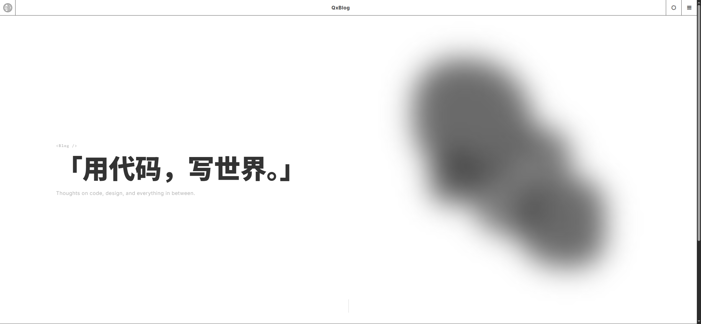

<div align="center">
    
    <h1>QxBlog</h1>
    <p>基于 GitHub Issues 的自动化博客框架</p>


</div>

基于 GitHub Issues 驱动的静态个人博客。通过 Issues 撰写 Markdown 文章，GitHub Actions 自动构建生成静态页面，无需本地环境。

## 演示



## 技术栈

- **前端**：原生 ES6 Modules，零框架依赖
- **样式**：纯 CSS，支持亮/暗主题切换
- **构建**：Node.js + jsdom + featherdown
- **部署**：GitHub Actions + GitHub Pages

## 功能

- 文章动态分页（省略号、页码跳转、前进后退）
- 分类标签系统，每个分类独立分页
- 文章目录侧边栏，平滑滚动锚点跳转
- 代码块一键复制
- 亮/暗主题自动跟随系统，支持手动切换
- 友情链接动态渲染
- 返回顶部按钮

## 目录结构

```
├── index.html                  # 首页
├── articles/                   # 文章列表 + 详情页
├── categories/                 # 分类列表 + 分类详情
├── about/                      # 关于页
├── blogData/                   # 动态数据（JSON）
│   ├── articles.json           # 文章索引
│   ├── articles/               # 分页数据
│   ├── categories.json         # 分类列表
│   └── categories/             # 分类分页
├── js/                         # 前端模块
│   ├── default.js              # 入口
│   ├── config.js               # 站点配置加载
│   ├── articles.js             # 文章加载 + 分页
│   ├── categories.js           # 分类加载
│   ├── nav.js                  # 导航（主题 + 侧边栏）
│   └── toc.js                  # 文章目录
├── css/
│   └── default.css             # 全局样式
├── config/
│   ├── siteConfig.json         # 站点配置
│   └── buildConfig.json        # 构建配置
└── .github/
    ├── workflows/              # CI/CD 工作流
    └── script/                 # 静态站点生成器
```

## 运行流程

### 文章发布

```
创建 Issue（Markdown + Label） 
    → GitHub Actions 触发构建
    → featherdown 渲染 Markdown
    → 生成文章 HTML（articles/pages/{id}.html）
    → 更新分页 JSON（blogData/articles/）
    → 更新分类 JSON（blogData/categories/）
    → 重新生成文章列表、分类列表、首页
    → 提交推送，GitHub Pages 自动部署
```

### 前端加载

```
页面加载 → 内联脚本注入 data-theme（防闪烁）
    → QxConfig 加载站点配置，渲染导航栏、侧边栏、Footer
    → QxArticles 从 blogData/articles/{page}.json 拉取分页数据
    → 动态渲染文章卡片 + 分页组件
    → 分类页同理，按 data-source 区分数据源
```

### 删除 / 编辑

编辑 Issue 触发相同流程，覆盖对应 `{id}.html` 和 JSON 分页。删除 Issue 移除文章文件并从索引中清除。

## 构建配置

`config/buildConfig.json`：

```json
{
    "timezoneOffset": "+08:00",
    "maxArticlesPerPage": 15
}
```

